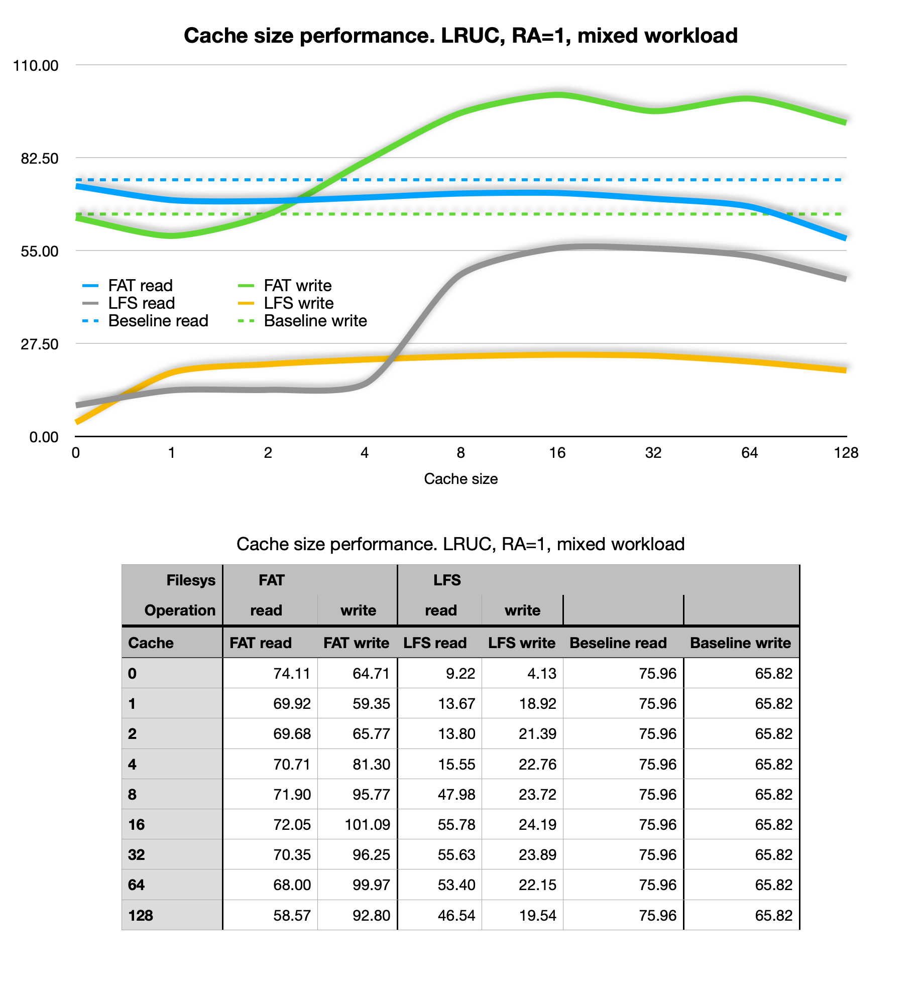
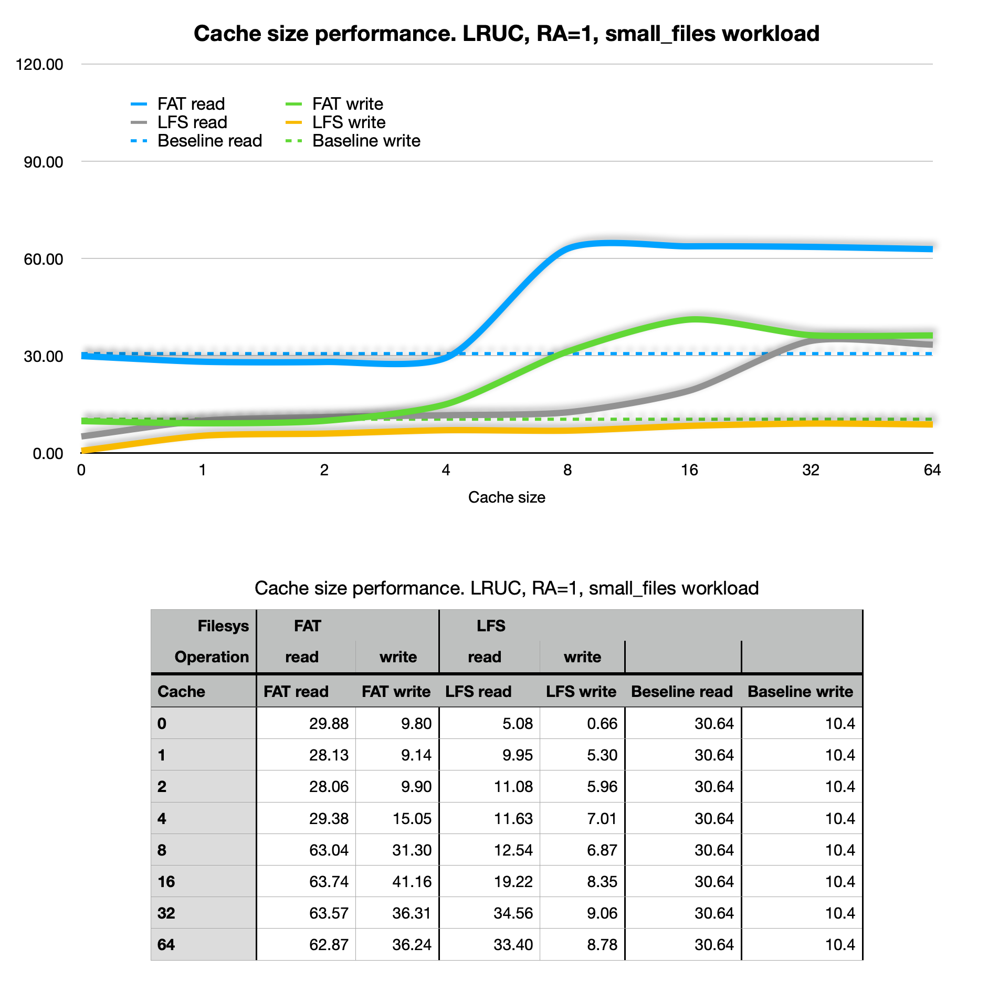
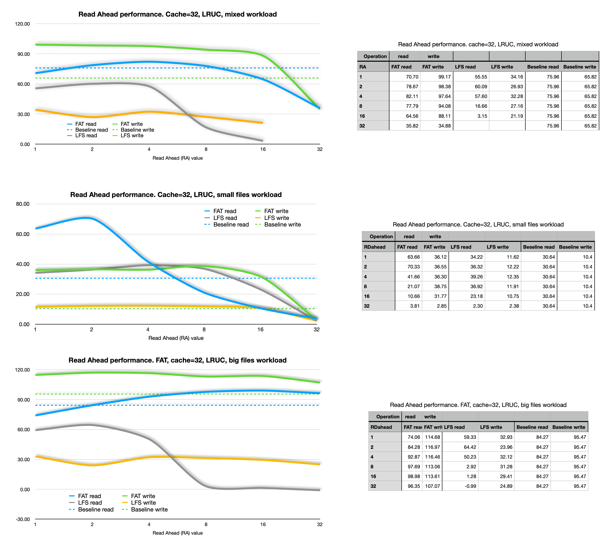
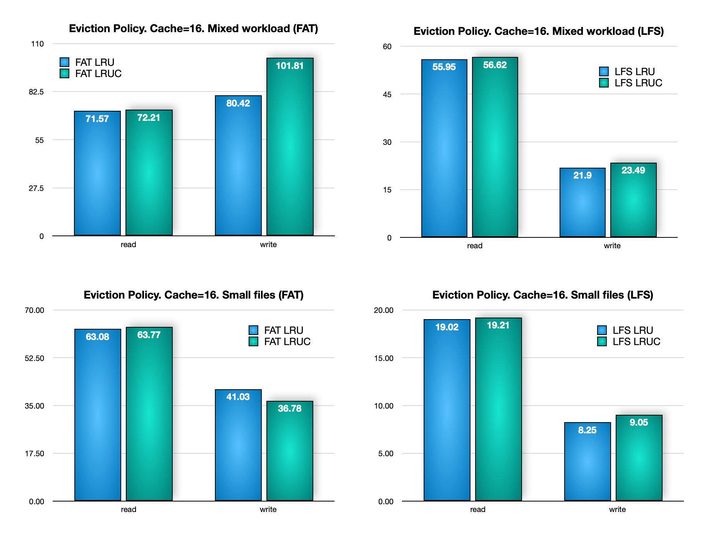

# Introduction

This document contains the results of the tests performed on the project. The results are usefull to understand the impact of the cache configuration on the driver's performance, but remember:

>**It all depends on the specific use case: the hardware, the app and the type of workload on the filesystem.**

All the test wer performed with the script [fs_test.py](tests/fs_test.py) and with the following workloads as reference (although I'm not posting all possible combinations).

```python
big_file = [(1, 512 * 1024)]
small_files = [[32, 1024]]
mixed = [[2, 128 * 1024], [2, 64 * 1024], [4, 16 * 1024], [4, 4 * 1024], [8, 1 * 1024], [8, 256]]
```

Each pair indicates the number of files and the size in bytes of each file that will be writtem, read and checked for consistency. Before the test, the order in which the workloads are executed is shuffled.

The performance of the original driver (only with FAT, obviously) is used as a reference.

I tested it on a ESP32-S3 (8MB of PSRAM), with an "*integrated*" SPI SD card breakout like [this one](https://www.adafruit.com/product/4899) running micropython v1.22.0-preview.1.g523284777.

## Results

### Cache size

This battery of test was performed with RA=1, LRUC eviction policy and different cache sizes for a couple of workload types.



- LFS performs really poorly without a cache on SD cards.
- LFS read speed is very sensitive to the cache size, but not so much the write speed.
- FAT write performance can also be greatly enhanced with the cache.
- Theres a point of diminishing returns.



- While overall performance is worse with small files (as expected), the cache impact is bigger, greatly improving both FAT and LFS performance, and bringing LFS performance close to the original FAT performance.

> I would like to experiment with the concept of *pinned blocks*, blocks that are never evicted from the cache, to see if it can improve even more the performance maintaining important blocks in the cache. But I would like it to be hard coded. If someone has good ideas for this let me know.

### Read ahead

This battery of test was performed with a cache size of 32 blocks, LRUC eviction policy and different read ahead policies for three workload types.

This feature was annoying to implement because it broke LFS in the first place, and in the end it turned out to be not so great, at least for the workloads I tested. I ended up setting the default RA to 1 (no read ahead) and reducing the maximum allowed read ahead to half of the cache size, and even going beyond 1/4 can be dangerous depending on the circumstances and the total cache size.



- Results are not consistent and highly dependant on the workload, with bigger files being the only case benefiting from read ahead on the high side.
- High read ahead values (relative to the cache size) can lead to a huge performance drop, so use with caution if at all.

### Eviction policy

This battery of test was performed with a cache size of 32 blocks, RA=1 and different eviction policies for two workload types.

The only evictions policies implemented right now (LRU -Least Recently Used block- and LRUC -Least Recently Used and Clean block-) are quite simple and performance difference is not huge, with a slight edge for LRUC in most cases.

I would like to see how more complex policies like ARC, LIRS or a simpler pinned blocks improvement would perform, but I'm not sure if the overhead would be too much for MCU' limited resources. It would also require updating the data structures.

You're wellcome to contribute with your ideas and code.


